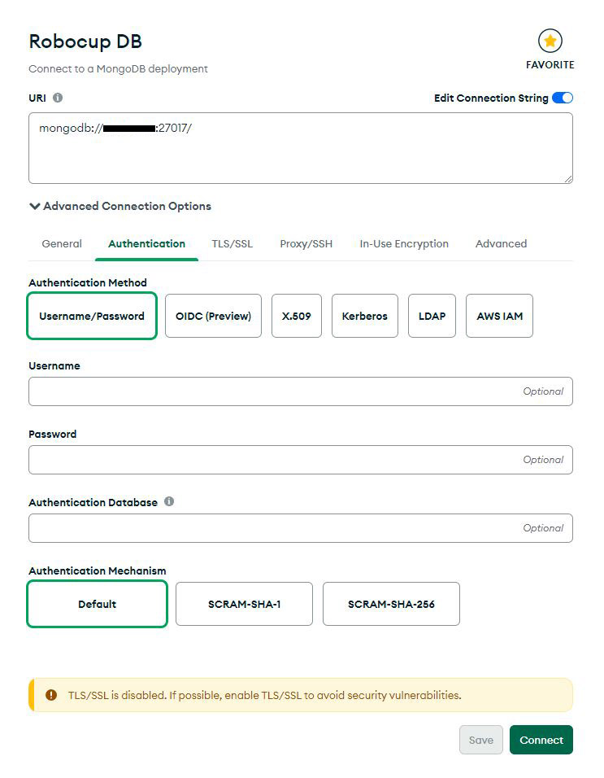

# Robocup Backend Documentation

There are two Servers running in this project:<br>
Production Server at [<prodserver>](http://<prodserver>/) <br>
Development Server at [<devserver>](http://<devserver>/)

Swagger UI documentation: http://<prodserver>/api/docs/

## Prerequisites
You need to have Docker with docker-compose installed which you can look up [here](https://docs.docker.com/compose/install/).<br>
During development the versions that were used are: Docker: 24.0.6, WSL: 2, docker-compose: 3.8

This Project is build with Node.js, you can find the installation instructions [here](https://nodejs.org/en/learn/getting-started/how-to-install-nodejs).<br>
We use version 20.10.0 currently.

Optional:
MongoDB Compass (GUI) is very useful for working with MongoDB, it can be downloaded [here](https://www.mongodb.com/try/download/compass).<br>
[More information](#mongodb-compass) on the use of MongoDB Compass.

## Set Up
This project can either be run on the server or locally (see [local development](#local-development)). Apart from different scripts and 
the database content, both of these options operate pretty much the same. It is recommended to use [local development](#local-development) 
with docker for your development environment.

Development on the server is not advised, but you can test small changes, see [development server](#development-server). To test changes, 
the best way is to develop and test locally and then commit. Finally, pull the changes on the development server and test them.

For either of these options you HAVE TO set the username and password for the application and root user, as well as rename 
the file .env.local.tmp to .env.local in core/ (See [Dotenv structure](#dotenv-structure)).

## Backend Structure
Docker container structure.
```
                                    +------------------------------------+
                                    |           core-robocupci-1         |
   +-------------------+            |       +--------------------+       |
   |     Frontend      |            |       |      Backend       |       |
   |    (React App)    +------------+------>|     (Node.js)      |       |
   +-------------------+   Build and Copy   |    + Frontend      |       |
                                    |        +-------------------+       |
                                    |                                    |
                                    +------------------------------------+       
                                                      |
                                                      V
                                           +---------------------+
                                           |   MongoDB Database  |
                                           |    core-mongodb-1   |
                                           +---------------------+
```

## Development Server
You can connect to the development server via ssh, if you are connected to the FRA-UAS network (via VPN or at the university). 
The url for the development server is <devserver>, connecting via ssh:
```shell
ssh user@<devserver>
```
Now you will be prompted to enter a password.

Although not recommended, it is possible to test small changes to the backend directly on the server. Using the `vim` tool 
for example you can edit files on the server.

Normally you would make and test changes with the [local development](#local-development) setup, commit and push them to GitLab.
Now you can simply pull these changes and test them on the server, although it shouldn't make a difference compared to your local test,
because both systems use docker.

## Local Development
This is the recommended setup for your personal development environment. You need to have `docker` installed and `Docker Desktop`
has to run, in order to work.

### How to run the Containers
Execute the following commands from the root of this project using a terminal:
1. Build the images:
```shell
docker compose -f docker-compose.dev.yml build
```
2. Initialize and run the containers:
```shell
docker compose -f docker-compose.dev.yml up -d
```
`-d` runs this command in detached mode.

This will expose the backend at localhost:80 and the MongoDB at localhost:27017. The database will be filled with 10 matches 
and 10 protocols. These matches and protocols will always be the same (see: core/data).

To stop and remove the containers:
```shell
docker compose -f docker-compose.dev.yml down
```
Alternatively, you can use the [Scripts](#available-scripts) 5&6 to init/run and stop/remove the containers.

***The Memory of the MongoDB is not persistent. Every change to data in the local docker MongoDB will be deleted after 
the container is deleted.***

If there are any problems with Docker, go to [Docker troubleshooting](#docker-troubleshooting).

## Available Scripts
Either `yarn [script]` or `npm run [script]` can be used to execute the following scripts.

| # | Script            | Description                                                                                                                                                                                          | Node Environment | Need VPN? |
|---|-------------------|------------------------------------------------------------------------------------------------------------------------------------------------------------------------------------------------------|------------------|-----------|
| 1 | `buildFrontend`   | Build the Frontend (../robocup-ci-vis), transfer the files into core/public/, build Backend; Helpful for testing Frontend and Backend changes; Only use on Server                                    |                  | Yes       |
| 2 | `build`           | Building the Backend only, copying Frontend files into core/public/. Does not build Frontend; Helpful for testing Backend changes; Only use on Server                                                |                  | Yes       |
| 3 | `start`           | Start production Docker containers with docker-compose.prod; containers core-mongodb-1 and core-robocupci-1; Only use on Server                                                                      | Production       | Yes       |
| 4 | `stop`            | Stop production Docker containers started with docker-compose.prod; Only use on Server                                                                                                               | Production       | Yes       |
| 5 | `startDevDocker`  | Recommended for local development; Init and start Docker containers for local development with docker-compose.dev; Only use locally; Local dev [setup](#local-development)                           | Default (None)   | No        |
| 6 | `stopDevDocker`   | Recommended for local development; Stop and remove Docker containers for local development with docker-compose.dev; Only use locally; Local dev [setup](#local-development)                          | Default (None)   | No        |
| 7 | `startDevWindows` | WINDOWS ONLY, NO DOCKER; Start Backend locally using npm package [nodemon](https://www.npmjs.com/package/nodemon); Have to start Frontend separately (see Frontend Scripts); connects to remote DB   | Development      | Yes       |
| 8 | `startDevLinux`   | LINUX/MAC ONLY, NO DOCKER; Start Backend locally using npm package [nodemon](https://www.npmjs.com/package/nodemon); Have to start Frontend separately (see Frontend Scripts); connects to remote DB | Development      | Yes       |

It is strongly recommended to use the [local development with docker](#local-development) (5&6) for personal development.
There are many advantages of using development with docker (5&6) instead of starting on your local machine and connecting 
to the remote MongoDB (7&8). You don't need a VPN connection (or an internet connection), you won't run into weird 
"it works on my machine but not on the server" issues, and so on...

The files for Frontend and Backend must be in the same folder in order to start the container core-robocupci-1 (See [Docker](#docker)).
Therefore, the Frontend files have to be copied into the folder core/public/ with every build Script (1&2). Which is kind of "hacky", because
the folder structure is hard coded into the script, therefore the structure on the server cannot change (w/o adapting the scripts).

The Node Environment is very important, because this is used to determine which .env.* file will be used to set the URL
for connection to the MongoDB. See [Dotenv Structure](#dotenv-structure) for more info.

The scripts for production (3&4) only start the containers. Running them without building and initializing containers won't 
do anything. How to build and initialize containers: [Setup containers](#setup-containers).

## Docker
The Frontend and Backend are running in the same Docker container `core-robocup-1`, from the image defined in core/*.Dockerfile. 
The database is running in a different container called `core-mongodb-1` from the official mongodb [docker image](https://hub.docker.com/_/mongo), 
current version: mongo:6.0.

Which dockerfile is used depends on the development environment, on the server prod.Dockerfile is used ([Script](#available-scripts) 3&4), for 
local development with docker the dev.Dockerfile is used ([Script](#available-scripts) 5&6).

### Setup containers
This shouldn't be an issue since the containers have already been build and initialized. If you had to reset the containers
however you have to build and initialize them again. Depending on your docker compose version you may need to use
`docker-compose` instead of `docker compose`, [more details](https://docs.docker.com/compose/migrate/).

Run these commands from the root of this project:
1. Build the images with Script 1 OR 2:
```shell
yarn buildFrontend
```
```shell
yarn build
```
2. Initialize the containers:
```shell
docker compose -f docker-compose.prod.yml up -d
```
`-d` runs this command in detached mode.
3. Now the containers can be started and stopped using the [Scripts](#available-scripts) 3&4.

### Reset containers
You can delete containers which can be helpful sometimes. Because they don't store any important information,
can containers be deleted. If a change doesn't work, this is the first thing you should try.

1. Make sure the container is stopped `docker ps`, if not run `docker stop container-name`
2. Lookup the container id for the container you want to remove (`-a` lists running and stopped containers):
```shell
docker ps -a
```
3. Remove the container by id:
```shell
docker container rm [conatainer-id]
```
Or you can use this command to remove all stopped containers:
```shell
docker container prune
```

Alternatively, you could just use the ``down`` keyword to stop and delete containers:
```shell
docker compose -f docker-compose.$environment.yml down
```

### Docker troubleshooting
#### Docker deamon not running
Start Docker: <br>
The most probable issue if you get an error that suggests that the Docker-Deamon is not running is that `Docker Desktop` 
was not started. To fix that you need to make sure that you did the [Prerequisites](#prerequisites) and started the 
`Docker Desktop` application.

Start as Admin: <br>
On some systems it is necessary to start `Docker Desktop` and also the `Terminal` as administrator in order to start docker-compose.

User Command Prompt instead of Powershell: <br>
In some cases the commands cannot be executed by using a Windows Powershell, depending on how WSL was installed. In that 
case using the `Command Prompt` terminal seemed to work.

#### Error when going to /allCommitsOverview
It was observed that an error can occurr when trying to visit "localhost:3000/allCommitsOverview", that tells the user that 
a reference to "team_l" could not be found. The cause for this error was not found yet, but a workaround that seemed to work, 
was to change the url to "localhost:3000/match" and then return back to "localhost:3000/allCommitsOverview". If this does not 
fix the problem, the problem has to be further investigated.

#### No Data in the docker MongoDB
data_in_local_db.sh started before backend was ready: <br>
When running the command `docker-compose -f docker-compose.dev.yml up` it can happen, that the script `data_in_local_db.sh` 
on the `db_setup` service is run, before the backend service is ready. You can check the docker logs to see if that was the problem. 
Just verify that all the log messages of the `db_setup` service appear after the `backend` service. If that is not the case you 
can seperatly start the `db_setup` service again, while the `backend` and `mongodb` services are still running. To do that use the following command:
```shell
docker-compose -f docker-compose.dev.yml up db_setup
```
data_in_local_db.sh: line 40: sytax error: unexpected "done" (expecting "do"): <br>
The Problem if you are seeing this error, is that you are probably using Windows and the Line-endings of the `data_in_local_db.sh` 
were changed from "LF" to "CLRF". This might be done by git or your IDE, depending on your setup. In this case just change the 
Line-endings of this particular file back to "LF". You can read this [Stackoverflow Post](https://stackoverflow.com/questions/27810758/how-to-replace-crlf-with-lf-in-a-single-file#:~:text=To%20convert%20the%20line%20end,%3A%20Windows%2C%20Mac%2C%20Linux.&text=eol%3Dlf,-save%20the%20folder) 
for inspiration on how to do this.

## MongoDB
In this project the MongoDB (mongo:6.0) image for [Docker](#docker) is used.

### MongoDB Set Up
The MongoDB is secured with Authentication. The username and password have to be set in the file core/.env.local. 
Simply rename the /core/.env.local.tmp file (delete the ".tmp" part) and insert the username and password for both the 
application and root user.

### MongoDB Compass
MongoDB Compass is the official GUI for MongoDB. It can be used for querying, optimizing, and analysis of a MongoDB Database. 
Although not necessary for this project, it has many quality of life functions. To use simply download and install 
MongoDB Compass (from link below). To connect to the database you need to be connected via VPN to FRA-UAS. Now you can 
connect using this URL: mongodb://<devserver>:27017/ to the database. Now click on "Advanced Connection Options" and 
then "Authentication". Here you can enter the Username, Password, and the Authentication Database "robocup". This of course 
works for local development with docker too, just change the URL to mongodb://localhost:27017/.

   

More information on MongoDB Compass [here](https://www.mongodb.com/products/tools/compass).

### MongoDB Authentication
In case the database should be reset fully, the core/mongo-init.js script enables authentication and sets up the root user 
and the application user for the database robocup automatically. This only works if the database is completely empty, 
i.e. the volume set in docker-compose.prod.yml needs to be empty. Alternatively you can set up these users with MongoDB 
Compass, just make sure to use the same usernames and passwords as in the core/.env.local file.

If the script (core/mongo-init.js) does not work the MongoDB Compass shell can be used to set up the root user and application user:
1. Login in to the remote Database (no authentication) via URL mongodb://<devserver>:27017
2. Open the integrated shell and connect to the admin database: `use admin`
3. Set up the root user and password with, in the following steps make sure to use the correct user-password combinations.
```
db.createUser({
    user: "root",
    pwd: "rootPass",
    roles: [ { role: "root", db: "admin"} ]
})
```
4. Next connect to the database robocup: `use robocup`
5. Set up the application user for the robocup database
```
db.createUser({
    user: "user",
    pwd: "pass",
    roles: [ { role: "readWrite, db: "robocup" } ]
})
```
6. Now authentication is enabled.

### Mongo Init Script
This script will be used to restore the application username and password in case the database is deleted completely, 
i.e. the directory specified in the docker-compose.yml file (currently /home/user/dev/robocup-ci/node/mongo/data/) is empty. 
The script is loaded into the 'docker-entrypoint-initdb.d/' directory within the container. Files with extensions .sh and .js 
located here will be executed on the first initialization of the database. See ["Initializing a fresh instance"](https://hub.docker.com/_/mongo#:~:text=and%20MONGO_INITDB_ROOT_PASSWORD.-,Initializing%20a%20fresh%20instance,-When%20a%20container) 
on the official mongodb docker image page for more information.

## Dotenv structure
In this project we make use of environment variables and the npm package dotenv-flow. This allows for additional management 
and control of environment variables. We make use of 4 .env files: .env, .env.local, .env.production, and .env.development.
 
For security reasons not all .env files should be pushed to GitLab. Specifically the core/.env.local file contains the 
usernames and passwords in plain text. Instead, we use a template file which has to be renamed and edited by the user. 
It is required to rename .env.local.tmp to .env.local (in core/) and add both the root and the application username and password.

We use different Node Environments in the [Scripts](#available-scripts) (NODE_ENV) to determine which .env.* file to use, to set the MongoDB URL:

| NODE_ENV     | MongoDB URL                                     | Description                       | [Script](#available-scripts) |
|--------------|-------------------------------------------------|-----------------------------------|------------------------------|
| production   | mongodb://mongodb:27017/?authSource=robocup     | Connect to MongoDB on Server      | 3 & 4                        |
| default ('') | mongodb://localhost:27017                       | Connect to locally hosted MongoDB | 7 & 8                        |
| development  | mongodb://<devserver>:27017/?authSource=robocup | Connect to remote MongoDB         | 5 & 6                        |

Checkout the [dotenv-flow](https://www.npmjs.com/package/dotenv-flow) documentation for more details.

### Environment Variables
Currently, we are setting a few different environment variables in the 3 files specified above. Two of these variables, 
located in the .env.local file have to remain the same for the MongoDB to function. The variables `MONGO_INITDB_ROOT_USERNAME` and 
`MONGO_INITDB_ROOT_PASSWORD` are used to set the root username and password in case a fresh instance of the database is initialized. 
These two environment variables are read by the MongoDB container by default and should NOT be renamed.
